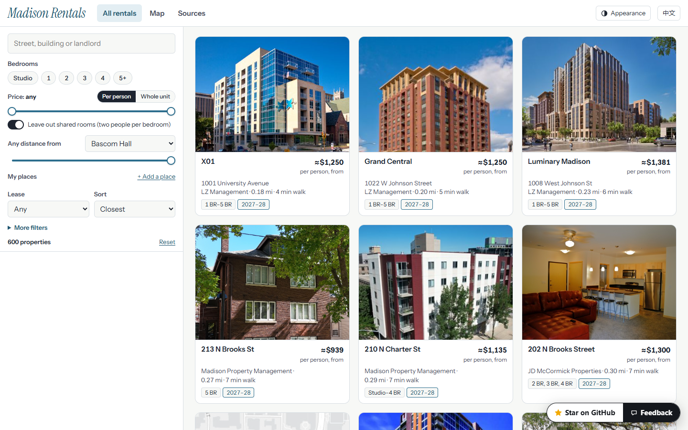
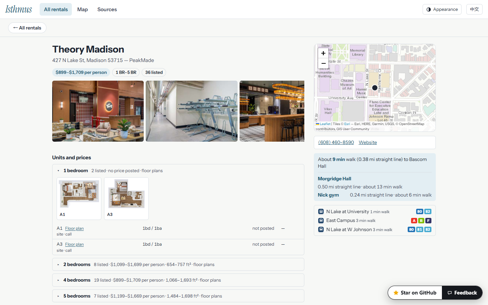
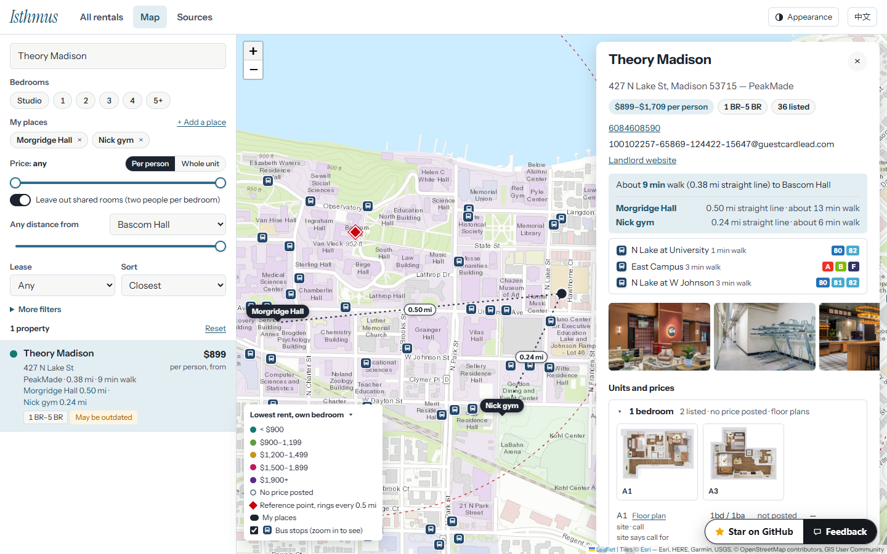
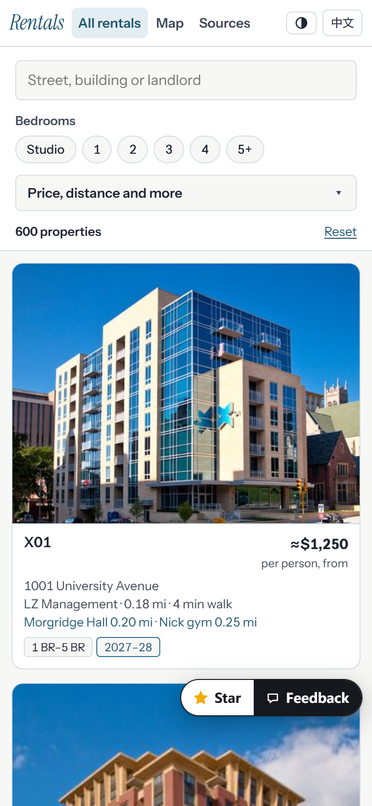
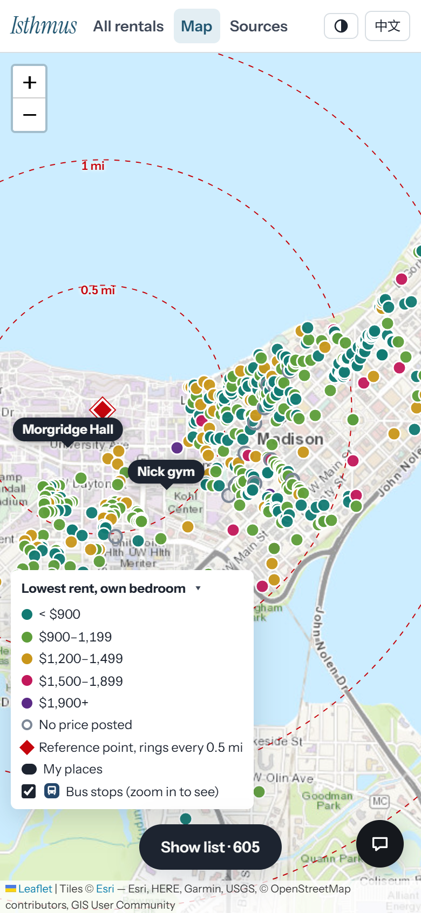

# Madison campus rentals map

A map of rentals within two miles of the UW–Madison campus: 600 properties, 2,959 units or floor plans and 67 landlords, collected on 2026-09-30. Listings come straight from landlord websites and the UW Off-Campus Housing service, and every value on the map says where it came from.

**[Open the map](https://housing.madisonstudents.com/)**

## What you can do

- Browse every rental as a photo card with its lowest price, bedrooms and walking distance, or switch to the map. A card opens the property's own page: units and prices on the left, a small map, contact details, walking time and nearby bus stops on the right. The page has its own link, so it can be shared.
- Filter by bedrooms, a price range (per person or for the whole unit), lease year, distance from a campus landmark or from one of your own places, and by heat or all utilities included, internet, cats, dogs, in-unit laundry, parking, furniture, air conditioning or landlord.
- Leave out shared rooms, where two people split one bedroom. This is on by default, so a price means one person with their own bedroom.
- Sort by distance, nearest bus stop, distance to your places, price (low to high or high to low), price per square foot, unit size, earliest move-in, number of units to choose from, or fewest missing details. Each listing shows the value it was sorted by.
- Open a property to see every unit with its rent, size and move-in date, floor plan drawings where the landlord publishes them (44 properties), up to three nearby Madison Metro stops with their routes, photos, and anything still unknown.
- Save the places you go often by searching an address, clicking the map or using your phone's location. Every rental then shows its straight-line distance to each place, and opening one draws a dashed line to each.
- Zoom in to street level to see 305 Madison Metro bus stops.
- Switch between English and Chinese, light and dark, and a color, gray or satellite map.

 

## How prices are labeled

Landlords quote rent either per person or for the whole unit, and listings often do not say which. Each price on the map is marked one or the other, with the reason: the listing's own wording, the landlord's written policy, the label on the UW listing, or the building's other prices. When none of those settles it, the price is read whichever way puts one person between $800 and $1,500 a month. A per-person figure shown with ≈ is whole-unit rent divided by bedrooms.

## Sources and privacy

- Listings: landlord websites and the UW Off-Campus Housing service, collected on 2026-09-30. Individual landlords who appear only on the UW list have their phone and email left out here; those properties link to the UW listing instead.
- Bus stops and routes: Madison Metro Transit's GTFS feed.
- Map: Leaflet, with tiles from Esri and map data © OpenStreetMap contributors.
- The listings are served by an API that hands out one page or one property at a time and logs each request anonymously (which property was opened, which filters and search words were used) to improve the page and spot bulk copying. No names are stored, IP addresses only as a one-way hash, and no cookies are set; the coordinates of your saved places are never logged.
- Your saved places stay in your own browser. Searching for an address sends what you type to OpenStreetMap's Nominatim service.

Prices and availability change quickly. Treat this as a starting point and confirm details with the landlord before you sign anything.
